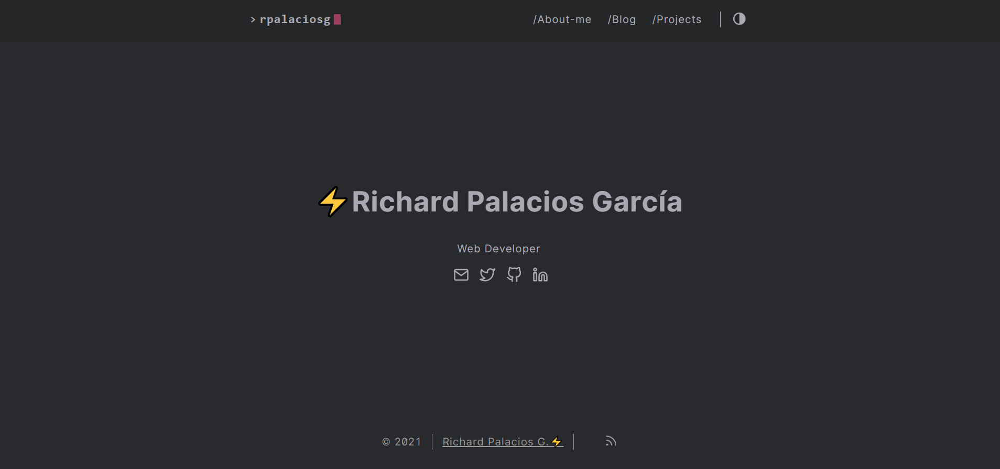

# Sitio Web Personal

Creación y configuración de mi sitio web personal. [](https://app.netlify.com/sites/rpalaciosg/deploys)



Este contendrá: 

- Aboutme
- Blog/post
- Portfolio

Está alojado en [Netlify](https://www.netlify.com/) y *GitHub* con implementación continua.

Basado en el framework generador de Sitios estáticos [HUGO](https://gohugo.io/)
Usando el tema [hello-friend-ng](https://themes.gohugo.io/hugo-theme-hello-friend-ng/)

## Instalación

Use git para clonar este repositorio:

```
    git clone https://github.com/rpalaciosg/rpalaciosg /nombre-tu-repo-clon
```

```
    cd nombre-tu-repo-clon
```

Iniciar el servidor Hugo:

```
    hugo server -D
```

En tu navegador ingresar esta dirección:

```
    localhost: 1313
```
